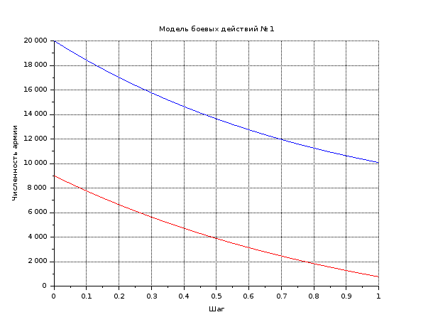
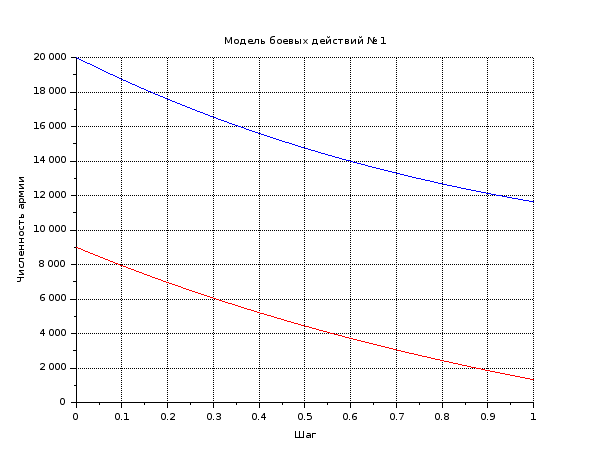

---
# Front matter
lang: ru-RU
title: "Шаблон отчёта по лабораторной работе"
subtitle: "Простейший вариант"
author: "Дмитрий Сергеевич Кулябов"

# Formatting
toc-title: "Содержание"
toc: true # Table of contents
toc_depth: 2
lof: true # List of figures
lot: true # List of tables
fontsize: 12pt
linestretch: 1.5
papersize: a4paper
documentclass: scrreprt
polyglossia-lang: russian
polyglossia-otherlangs: english
mainfont: PT Serif
romanfont: PT Serif
sansfont: PT Sans
monofont: PT Mono
mainfontoptions: Ligatures=TeX
romanfontoptions: Ligatures=TeX
sansfontoptions: Ligatures=TeX,Scale=MatchLowercase
monofontoptions: Scale=MatchLowercase
indent: true
pdf-engine: lualatex
header-includes:
  - \linepenalty=10 # the penalty added to the badness of each line within a paragraph (no associated penalty node) Increasing the value makes tex try to have fewer lines in the paragraph.
  - \interlinepenalty=0 # value of the penalty (node) added after each line of a paragraph.
  - \hyphenpenalty=50 # the penalty for line breaking at an automatically inserted hyphen
  - \exhyphenpenalty=50 # the penalty for line breaking at an explicit hyphen
  - \binoppenalty=700 # the penalty for breaking a line at a binary operator
  - \relpenalty=500 # the penalty for breaking a line at a relation
  - \clubpenalty=150 # extra penalty for breaking after first line of a paragraph
  - \widowpenalty=150 # extra penalty for breaking before last line of a paragraph
  - \displaywidowpenalty=50 # extra penalty for breaking before last line before a display math
  - \brokenpenalty=100 # extra penalty for page breaking after a hyphenated line
  - \predisplaypenalty=10000 # penalty for breaking before a display
  - \postdisplaypenalty=0 # penalty for breaking after a display
  - \floatingpenalty = 20000 # penalty for splitting an insertion (can only be split footnote in standard LaTeX)
  - \raggedbottom # or \flushbottom
  - \usepackage{float} # keep figures where there are in the text
  - \floatplacement{figure}{H} # keep figures where there are in the text
---

# Цель работы

Рассмотрим некоторые простейшие модели боевых действий – модели
Ланчестера. В противоборстве могут принимать участие как регулярные войска,
так и партизанские отряды. В общем случае главной характеристикой соперников
являются численности сторон. Если в какой-то момент времени одна из
численностей обращается в нуль, то данная сторона считается проигравшей (при
условии, что численность другой стороны в данный момент положительна).

# Задание

Между страной Х и страной У идет война. Численность состава войск
исчисляется от начала войны, и являются временными функциями
 $x(t)$ и $y(t)$. В начальный момент времени страна $Х$ имеет армию численностью 150 000 человек,
а в распоряжении страны $Y$ армия численностью в 100 000 человек. Для упрощения модели считаем, что коэффициенты $a, b, c, h$ постоянны. Также считаем $P(t)$ и $Q(t)$ непрерывные функции.
Постройте графики изменения численности войск армии Х и армии У для
следующих случаев:

1. Модель боевых действий между регулярными войсками
 $$ \frac{dx}{dt}= -0.45x(t) -0.85y(t) + sin(t+8) + 1$$
 $$ \frac{dy}{dt}= -0.45x(t) -0.45y(t) + cos(t+8) + 1$$
 
2. Модель ведение боевых действий с участием регулярных войск и
партизанских отрядов

 $$ \frac{dx}{dt}= -0.31x(t) -0.79y(t) + 2sin(t)$$
 $$ \frac{dy}{dt}= -0.41x(t)y(t) -0.32y(t) + 2cos(t)1$$


# Выполнение лабораторной работы

Здесь кратко описываются итоги проделанной работы.

Модель боевых действий между регулярными войсками:

```scilab
//начальные условия
x0 = 20000;     //численность первой армии
y0 = 9000;      //численность второй армии
t0 = 0;         //начальный момент времени

a = 0.45;       //константа, характеризующая степень влияния различных факторов на потери
b = 0.85;       //эффективность боевых действий армии у
c = 0.45;       //эффективность боевых действий армии х
h = 0.45;       //константа, характеризующая степень влияния различных факторов на потери

tmax = 1;       //предельный момент времени
dt = 0.05;      //шаг изменения времени
t = [t0:dt:tmax];

function p = P(t)//возможность подхода подкрепления к армии х
    p = sin(t + 8) + 1;
endfunction

function q = Q(t)//возможность подхода подкрепления к армии у
    q = cos(t + 8) + 1  ;
endfunction

//Система дифференциальных уравнений
function dy = syst(t, y)
    dy(1) = - a*y(1) - b*y(2) + P(t);//изменение численности первой армии
    dy(2) = - c*y(1) - h*y(2) + Q(t);//изменение численности второй армии
endfunction

v0 = [x0;y0];//Вектор начальных условий

//Решение системы
y = ode(v0,t0,t,syst);

//Построение графиков решений
scf(0);
plot2d(t,y(1,:),style=2);//График изменения численности армии х (синий)
xtitle('Модель боевых действий № 1','Шаг','Численность армии');
plot2d(t,y(2,:), style = 5);//График изменения численности армии у (красный)
xgrid();
```

{ #fig:001 width=70% }

Модель ведение боевых действий с участием регулярных войск и
партизанских отрядов:

```scilab
//начальные условия
x0 = 20000;     //численность первой армии
y0 = 9000;      //численность второй армии
t0 = 0;         //начальный момент времени

a = 0.31;       //константа, характеризующая степень влияния различных факторов на потери
b = 0.79;       //эффективность боевых действий армии у
c = 0.41;       //эффективность боевых действий армии х
h = 0.32;       //константа, характеризующая степень влияния различных факторов на потери

tmax = 1;       //предельный момент времени
dt = 0.05;      //шаг изменения времени
t = [t0:dt:tmax];

function p = P(t)//возможность подхода подкрепления к армии х
    p = 2*sin(t);
endfunction

function q = Q(t)//возможность подхода подкрепления к армии у
    q = 2*cos(t);
endfunction

//Система дифференциальных уравнений
function dy = syst(t, y)
    dy(1) = - a*y(1) - b*y(2) + P(t);//изменение численности первой армии
    dy(2) = - c*y(1) - h*y(2) + Q(t);//изменение численности второй армии
endfunction

v0 = [x0;y0];//Вектор начальных условий

//Решение системы
y = ode(v0,t0,t,syst);

//Построение графиков решений
scf(0);
plot2d(t,y(1,:),style=2);//График изменения численности армии х (синий)
xtitle('Модель боевых действий № 1','Шаг','Численность армии');
plot2d(t,y(2,:), style = 5);//График изменения численности армии у (красный)
xgrid();
```

{ #fig:001 width=70% }
# Выводы

Рассмотрели задачу о моделе Ланчестера. Все щаги били успещно выполнёны.
