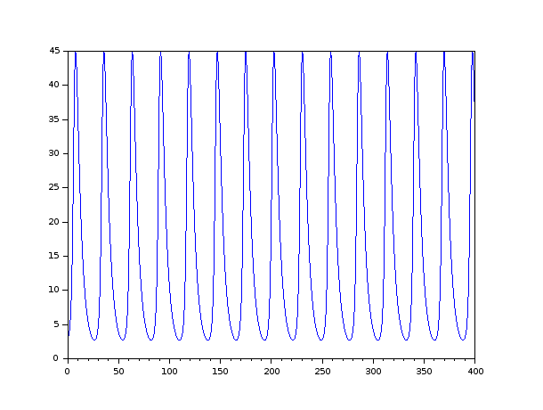
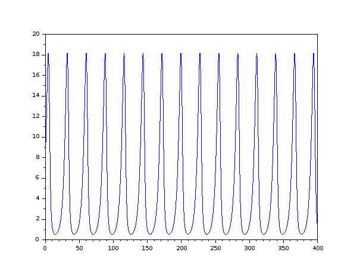
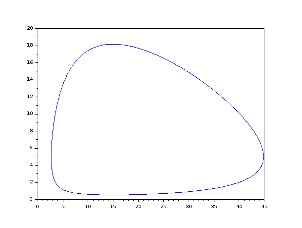

---
# Front matter
lang: ru-RU
title: "Шаблон отчёта по лабораторной работе"
subtitle: "Простейший вариант"
author: "Дмитрий Сергеевич Кулябов"

# Formatting
toc-title: "Содержание"
toc: true # Table of contents
toc_depth: 2
lof: true # List of figures
lot: true # List of tables
fontsize: 12pt
linestretch: 1.5
papersize: a4paper
documentclass: scrreprt
polyglossia-lang: russian
polyglossia-otherlangs: english
mainfont: PT Serif
romanfont: PT Serif
sansfont: PT Sans
monofont: PT Mono
mainfontoptions: Ligatures=TeX
romanfontoptions: Ligatures=TeX
sansfontoptions: Ligatures=TeX,Scale=MatchLowercase
monofontoptions: Scale=MatchLowercase
indent: true
pdf-engine: lualatex
header-includes:
  - \linepenalty=10 # the penalty added to the badness of each line within a paragraph (no associated penalty node) Increasing the value makes tex try to have fewer lines in the paragraph.
  - \interlinepenalty=0 # value of the penalty (node) added after each line of a paragraph.
  - \hyphenpenalty=50 # the penalty for line breaking at an automatically inserted hyphen
  - \exhyphenpenalty=50 # the penalty for line breaking at an explicit hyphen
  - \binoppenalty=700 # the penalty for breaking a line at a binary operator
  - \relpenalty=500 # the penalty for breaking a line at a relation
  - \clubpenalty=150 # extra penalty for breaking after first line of a paragraph
  - \widowpenalty=150 # extra penalty for breaking before last line of a paragraph
  - \displaywidowpenalty=50 # extra penalty for breaking before last line before a display math
  - \brokenpenalty=100 # extra penalty for page breaking after a hyphenated line
  - \predisplaypenalty=10000 # penalty for breaking before a display
  - \postdisplaypenalty=0 # penalty for breaking after a display
  - \floatingpenalty = 20000 # penalty for splitting an insertion (can only be split footnote in standard LaTeX)
  - \raggedbottom # or \flushbottom
  - \usepackage{float} # keep figures where there are in the text
  - \floatplacement{figure}{H} # keep figures where there are in the text
---

# Цель работы

Простейшая модель взаимодействия двух видов типа «хищник — жертва» -
модель Лотки-Вольтерры. Данная двувидовая модель основывается на
следующих предположениях:
1. Численность популяции жертв x и хищников y зависят только от времени
(модель не учитывает пространственное распределение популяции на
занимаемой территории)
2. В отсутствии взаимодействия численность видов изменяется по модели
Мальтуса, при этом число жертв увеличивается, а число хищников падает
3. Естественная смертность жертвы и естественная рождаемость хищника
считаются несущественными
4. Эффект насыщения численности обеих популяций не учитывается
5. Скорость роста численности жертв уменьшается пропорционально
численности хищников

# Задание

Для модели «хищник-жертва»:

$$\begin{cases} 
\frac{dx}{dt}=-0.22x(t) + 0.044x(t)y(t)   \\ 
\frac{dy}{dt}=0.33y(t)-0.022x(t)y(t)
\end{cases}$$
Постройте график зависимости численности хищников от численности жертв,
а также графики изменения численности хищников и численности жертв при
следующих начальных условиях: $x_0=3$, $y_0=8$ Найдите стационарное
состояние системы.

# Выполнение лабораторной работы

Построение зависимости численности популяций хищников и жертв (фазовый
портрет системы). Код в среде Scilab:

```scilab
a= 0.22;  // коэффициент естественной смертности хищников
b= 0.33;  // коэффициент естественного прироста жертв
c= 0.044; // коэффициент увеличения числа хищников
d= 0.022; // коэффициент смертности жертв

function dx=syst2(t, x)
    dx(1) = -a*x(1) + c*x(1)*x(2);
    dx(2) =  b*x(2) - d*x(1)*x(2);
endfunction

t0 = 0;
x0=[3;8]; //начальное значение x и у (популяция хищников и популяция жертв)
t = [0: 0.1: 400];
y = ode(x0, t0, t, syst2);
n = size(y, "c");
for i = 1: n
y2(i) = y(2, i);
y1(i) = y(1, i);
end

plot(t, y1); //построение графика колебаний изменения числа популяции хищников
plot(t, y2); //построение графика колебаний изменения числа популяции жертв
plot(y1, y2); //построение графика зависимости изменения численности хищников от изменения численности жертв
```

{ #fig:001 width=70% }
{ #fig:001 width=70% }
{ #fig:001 width=70% }
# Выводы

Рассмотрели задачу о моделе «хищник-жертва». Все щаги били успещно выполнёны.
